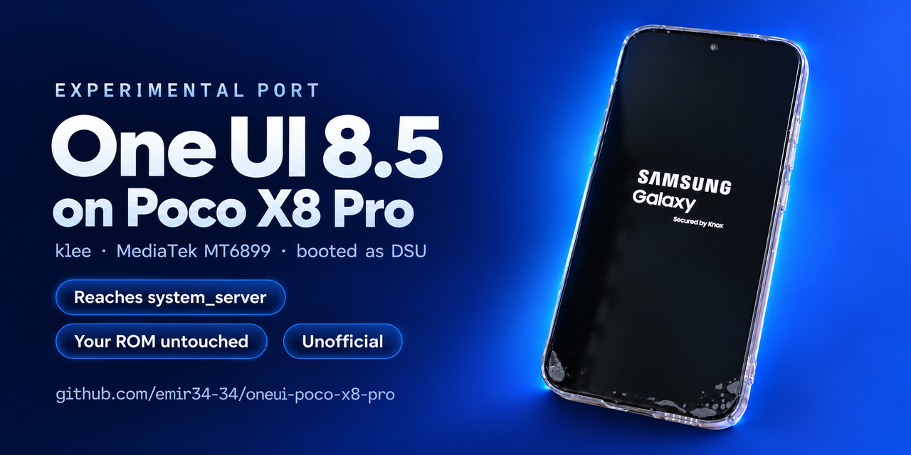
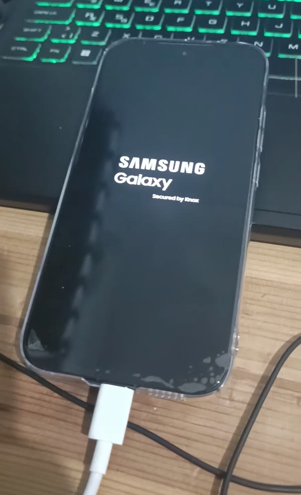
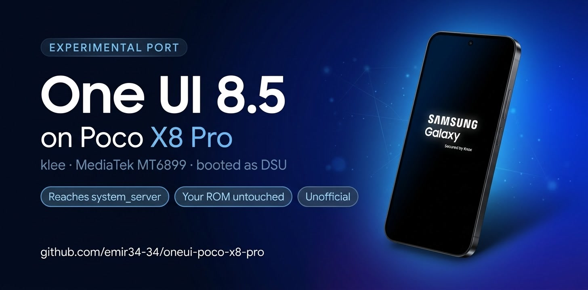
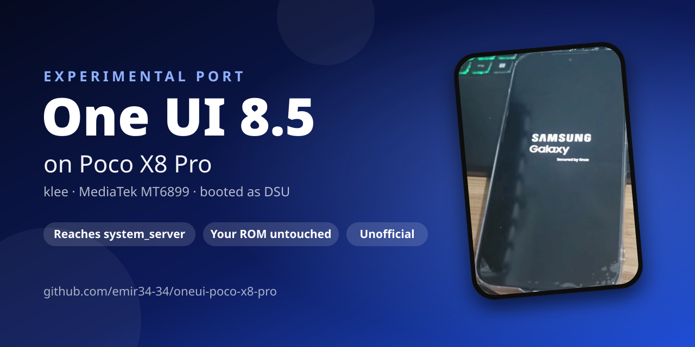

# One UI 8.5 on the Poco X8 Pro (klee, MT6899) — experimental DSU port

This is an attempt to run Samsung's One UI 8.5 (Android 16) system on the Xiaomi Poco X8 Pro
(codename `klee`, MediaTek mt6899), on top of the phone's own Xiaomi vendor. The system is booted
as a **DSU** (Dynamic System Update) image, so the installed ROM and `/data` are never touched.
If a test boot fails, the phone falls back to the normal ROM by itself.

> **Status: unfinished, paused (2026-10-08).** One UI gets as far as `system_server` but does not
> reach the UI yet. Everything learned so far is published here so that others can continue.
> Sister project: [Ubuntu Touch for the Poco X8 Pro](https://github.com/emir34-34/ubuntu-touch-poco-x8-pro).

## Disclaimer

**Use this at your own risk.** This is an experimental, unfinished port. Even though DSU leaves
the installed system alone, failed boots put the phone into a preloader/BROM loop for about two
minutes before it recovers. The author takes **no responsibility** for any damage to your device
or data, and gives **no support** for individual attempts. Provided "as is", without warranty of
any kind (GPL-2.0, sections 11 and 12).

This repository contains **no Samsung or Xiaomi files**, only patches, scripts and notes. You
need to download the firmware yourself.

## Screenshot

*The Poco X8 Pro booting the One UI DSU image (photo of the real device).*

## How far it got

| Step | Status |
|---|---|
| Samsung sepolicy compiles against the Xiaomi vendor policy | ✅ (`tools/secil_test_pc.sh`) |
| DSU image accepted (AVB hashtree footer, `skip_mount.cfg`, Samsung layout) | ✅ |
| `init`, `zygote` start | ✅ after the `napproxyd` socket label fix |
| `system_server` survives the vibrator service | ✅ (Samsung vibrator extension calls stubbed) |
| AudioPolicy loads | ✅ (Xiaomi's `audio.parameter_parser` service added) |
| `JobSchedulerService` / battery info | ❌ **current blocker**: `BatteryService` gets no `HealthInfo` |
| UI, USB/adb in One UI | ❌ not reached / USB does not work |

The fix for the current blocker is written (`KleeAospHealthCallback` in
`patches/services.jar.patch`), but **not hooked up and never tested**. See
[docs/NOTES.md](docs/NOTES.md#current-blocker-battery-info).

Before this, a stock **Google Android 17 GSI** booted fine as a DSU on the same phone, with
cameras, earpiece, audio and vibration working. The vendor is Treble-compatible, and the
remaining problems are Samsung-specific.

## Repository layout

| Path | Contents |
|---|---|
| `patches/services.jar.patch` | smali patch for `/system/framework/services.jar`: health callback, vibrator stubs, and the new `KleeAospHealthCallback` class |
| `patches/system-build.prop.patch` | `ro.debuggable=1`, `ro.adb.secure=0`, `persist.sys.usb.config=mtp,adb` |
| `patches/plat_file_contexts.patch` | label for `/dev/socket/napproxyd` |
| `patches/skip_mount.cfg` | from the AOSP GSI; put it in `/system/etc/init/config/` and `/system_ext/etc/init/config/` |
| `patches/android.hardware.audio.parameter_parser.service.rc` | init script of the Xiaomi audio service to copy from the stock/Axion `system_ext` |
| `sepolicy/` | CIL appended to `plat_sepolicy.cil`: the `napproxyd_socket` type and the permissive `oneuidbg` debug domain |
| `debuglog/` | debug service that dumps logcat/dmesg to `/metadata/oneui_debug` during the boot (USB does not work in One UI) |
| `tools/build_oneui.sh` | repacks `services.jar`, builds the EROFS image with the AVB footer, optionally installs it via `gsi_tool` |
| `tools/secil_test_pc.sh`, `tools/secil_test_device.sh` | emulate init's split-policy compilation (PC / on the phone) |
| `tools/erofs-utils-fsck.patch` | lets `fsck.erofs --extract` run in a user namespace (no root) and log file capabilities |
| `tools/resolve.py` | resolves the libraries the audio service needs against the One UI root |
| `docs/screenshots/`, `docs/banner.png` | photo of the device booting One UI, banner |
| `docs/NOTES.md` | **everything learned so far, how to rebuild the image, and what to do next** |

## Banners

The banner at the top was made with ChatGPT from the photo of the real device. Two
alternatives, free to use for posts about the project:

| `docs/banner2.jpg` (Gemini) | `docs/banner3.png` (hand-made from the photo) |
|---|---|
|  |  |

## Credits

Samsung firmware download: [samloader-rs](https://github.com/topjohnwu/samloader-rs). Tools:
apktool, erofs-utils, AOSP avbtool and secilc. Thanks to the Poco X8 Pro community.

## License

GPL-2.0 for the scripts, patches and notes in this repository. Samsung's and Xiaomi's software
remains the property of its owners and is not included.
